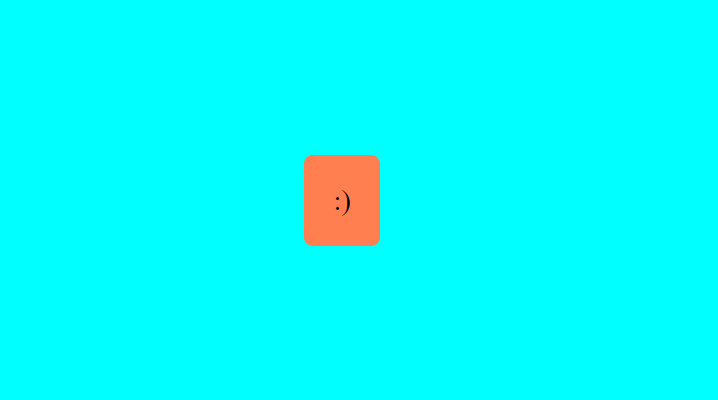
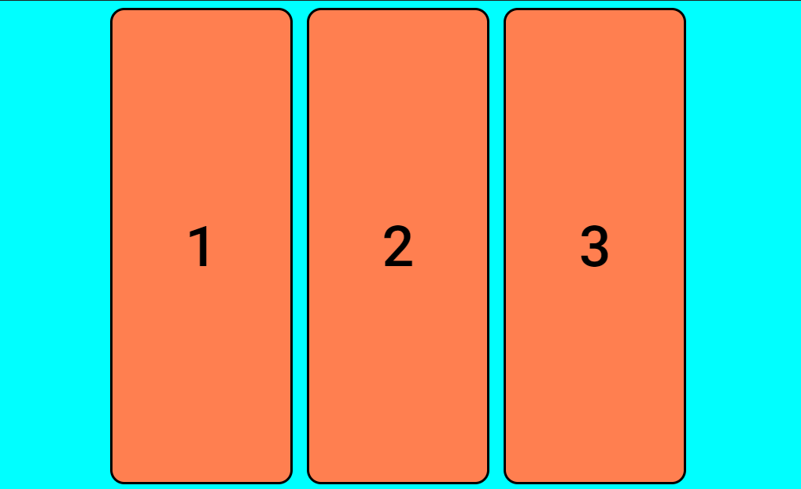
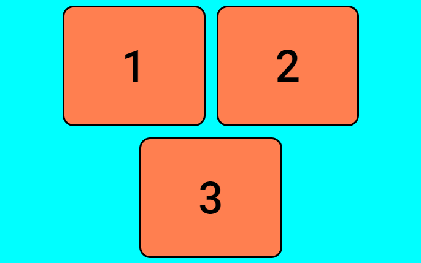
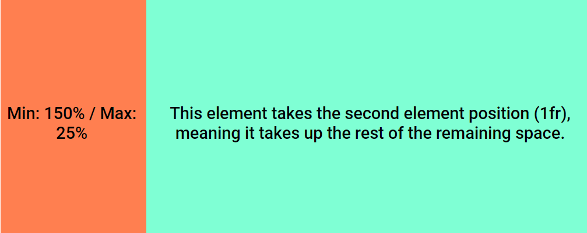
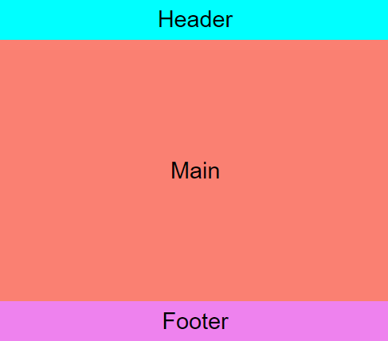
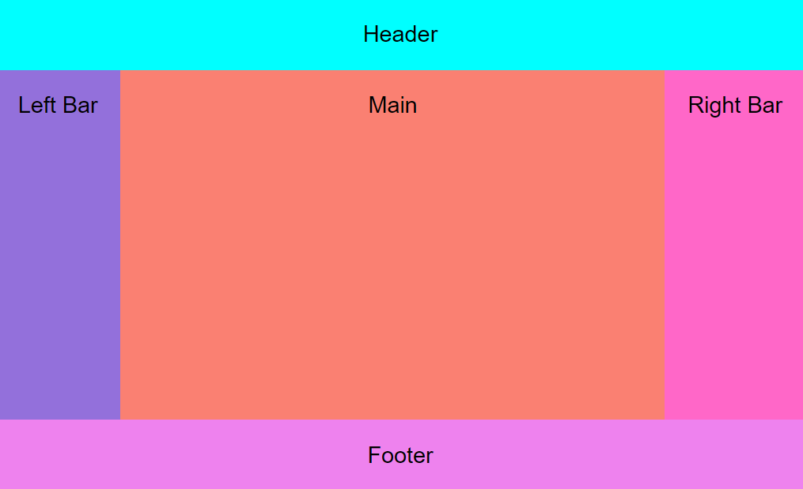
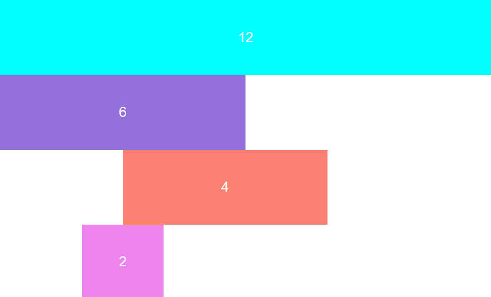
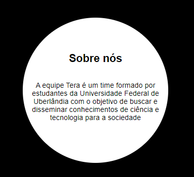
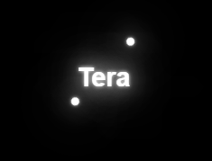
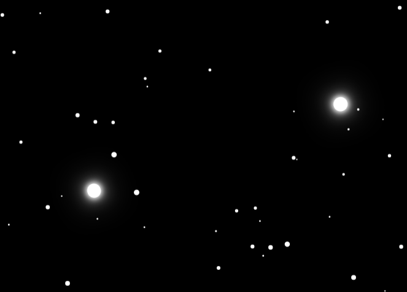

# Animations

Practicing web animations in CSS

## Responsivity

This is a collection of some card positioning and responsivity. It is inspared in a video of [Google Chrome Developers](https://www.youtube.com/watch?v=qm0IfG1GyZU).

### [Centering](https://erick-oliveira-et.github.io/Animations/projects/responsivity/centering/centering.html)

Center the position of the card in the center of the screen.

### [Deconstruction](https://erick-oliveira-et.github.io/Animations/projects/responsivity/deconstruction/deconstruction.html)

The cards resize and adapt with the resizing of the screen.

### [Sidebar](https://erick-oliveira-et.github.io/Animations/projects/responsivity/sidebar/sidebar.html)

The sidebar resizes proportionally with the size of the screen until a max point where it keeps constant.

### [Stack](https://erick-oliveira-et.github.io/Animations/projects/responsivity/stack/stack.html)

Use grid to stack the top, center and bottom. The top and bottom fit the content inside them and the center fill the space in between.

### [Common Layout](https://erick-oliveira-et.github.io/Animations/projects/responsivity/common_layout/common-layout.html)

The header, left bar, main, right bar and footer.

### [Bootstrap Grid Format](https://erick-oliveira-et.github.io/Animations/projects/responsivity/b-grid/b-grid.html)

The 12 columns bootstrap grid format.

## [Flip Card Hover](https://erick-oliveira-et.github.io/Animations/projects/flip-card-hover/flip-card-hover.html)

It's a image that when it's hovered it flips and have a text behind.

## [Tera Orbit Loading](https://erick-oliveira-et.github.io/Animations/projects/tera-orbit-loading/tera-orbit-loading.html)

Two spheres orbiting a word. This project uses particles.js to make the stars.

## [Tera Orbiting](https://erick-oliveira-et.github.io/Animations/projects/tera-orbit-spheres/tera-orbit-spheres.html)

An loading animation of two orbits coliding, generating an explosion em pulsing.

## [Center Card Flip](https://erick-oliveira-et.github.io/Animations/projects/card-flip-horizontal-cut/index.html)

Flip card articulated at the middle. Pretty comon in clockdown timers.

